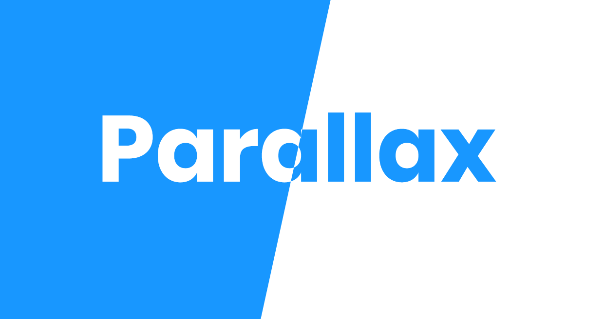
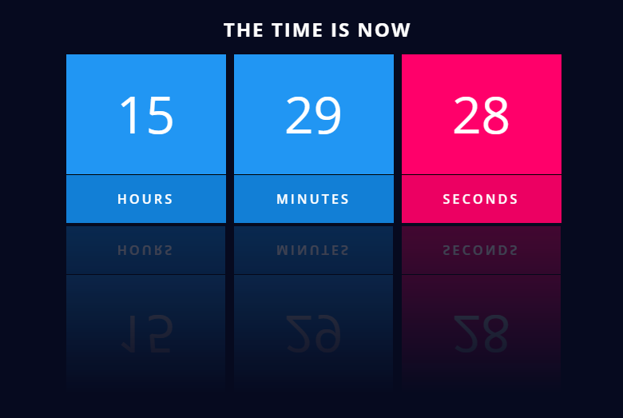
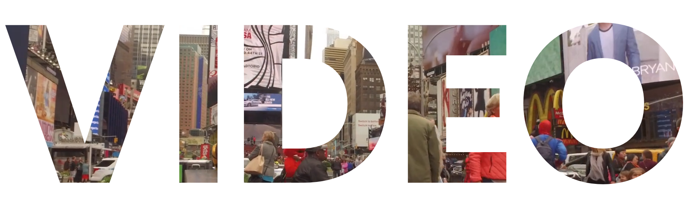
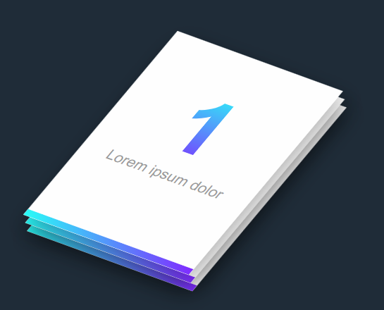
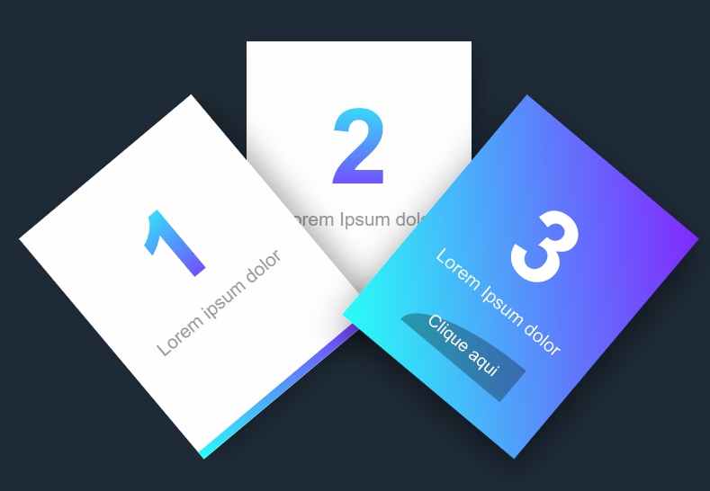

## Project to train html, css and javascript skills
Some effects built with css and javaScript

## LINK
(https://junioralvesbr.github.io/practice-html-css-javascript/)

## Parallax efects

_____
## The time is Now
Created a digital clock.

___
## Banner Video

___
## Isometric card

Created an isometric card with pure CSS animation and effects.

